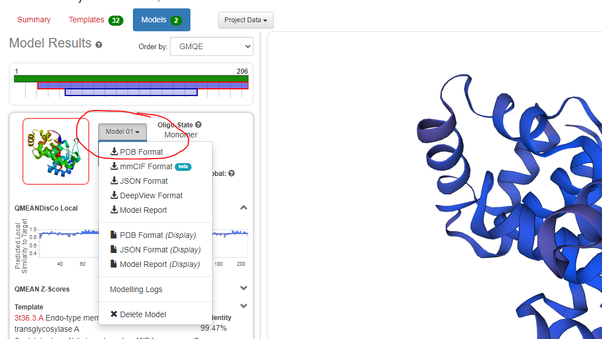
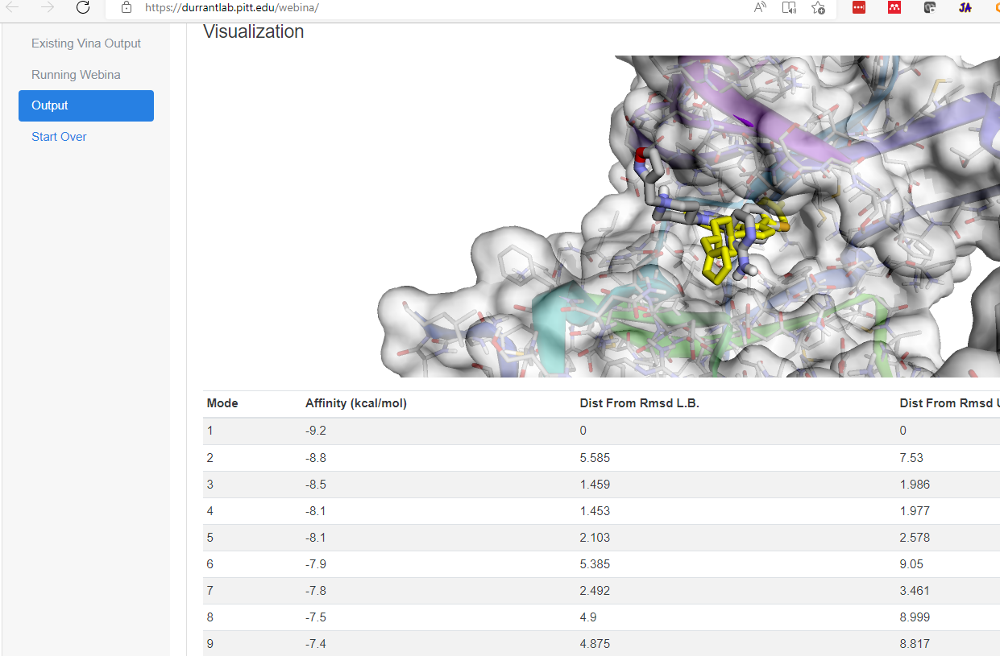

# Note on Submission<!-- omit from toc --> 

- You should submit to Canvas this week for this activity set.

---

- [Activity 4.1: Exploring ChimeraX](#activity-41-exploring-chimerax)
  - [Description](#description)
  - [Steps](#steps)
- [Activity 4.2: Homology Modelling with Swiss Model](#activity-42-homology-modelling-with-swiss-model)
  - [Background](#background)
  - [Description](#description-1)
  - [Steps](#steps-1)
- [Activity 4.3: Docking using Webina (A port of AutoDock Vina)](#activity-43-docking-using-webina-a-port-of-autodock-vina)
  - [Background](#background-1)
  - [Description](#description-2)
- [Activity 4.4: Interpreting Molecular Dynamics Plots](#activity-44-interpreting-molecular-dynamics-plots)
  - [Background](#background-2)
  - [Description](#description-3)

## Activity 4.1: Exploring ChimeraX

### Description

In this exercise, you will explore some proteins from RCSB using chimeraX.

### Steps

1. Open ChimeraX and run the following commands in the 'Command' box at the bottom of the screen (you will explain what each command does as part of this report):
   1. `open 4jjx`
   2. `color bychain`
   3. `select #1/A` # Look for the green outline around parts of the protein after you run this command
   4. `rainbow sel`
   5. `select ~sel`
   6. `delete sel`
   7. `surface`
   8. `color byhetero` # Hover your mouse over the newly colored atoms, What do the colors denote? Red,Blue, Yellow? 
   9. `~surface` # What does the '~' tilde character mean? This is the second time we have used it
   10. `distance #1/A:0@CA #1/A:171@CA` # What value does this compute? (Clue it is a parameter from our structures lecture this week)
   11. `hbonds reveal true` # What does this show? What can you conclude about the relationship between hydrogen bonds and the secondary structures (helices and sheets)?
2. Rotate your protein to showcase the distance and save this as a png file.
3. Write a report to explain what each of these commands AND answer the questions for each command.
4. Upload the mini-report (including the explanation of commands, image and image caption) to Canvas

---

## Activity 4.2: Homology Modelling with Swiss Model

### Background

Homology modelling attempts to predict the structure of a query primary sequence by comparison to a database of known structures. 

### Description

In this exercise, you will use the Swiss Model server to predict the structure of a protein already in the RCSB.  Effectively this is a positive control on the approach since we know an existing experimental structure exists for comparison.

### Steps

1. Navigate to the [RCSB](https://www.rcsb.org/)
2. Obtain the fasta sequence for the entry with RCSB accession ID: '4hjy' (this can be obtained from the 'Download Files' dropdown menu on the right hand side of the 4HJY entry page)
3. Navigate to the [Swiss Model website](https://swissmodel.expasy.org/interactive)
4. Paste in the contents or upload the fasta file as the input
5. Add an email and project name, while both are optional, it is often advised to include them, especially when a server job may take a while to complete
6. Start the modelling by clicking 'Build Model'
7. This server takes around ~15 minutes to complete
8. Once finished, you should have two models built.
9. Using the documentation: https://swissmodel.expasy.org/docs/help
10. Report the following for each model
    1.  The template used
    2.  The sequence identity
    3.  Coverage (the range modelled of the full query sequence)
    4.  GMQE
    5.  QMEANDisCo Global
    6.  Your conclusion on whether the model is reliable and why?
11. For the best model, we will now check against the actual '4hjy' structure.
    1.  Download the pdb file for the model
    2.  Load the pdb file into ChimeraX along with 4hjy
    3.  Perform a matchmaker between the model and the experimental structure
        1.  Note: the model is only one chain of the two chain protein so you should see the model superimpose onto one of the two chains
    4.  Export an image and answer the following question
        1.  Does the model appear to be largely consistent with the experimental structure why or why not?
12. Upload the writeup, figure and figure caption to Canvas

---

## Activity 4.3: Docking using Webina (A port of AutoDock Vina)

### Background

Molecular Docking can be used to predict energetically plausible interactions between proteins and ligands.  Inputs are the two molecules of interest and often times a designation about the region of the protein to search interactions against.  In the exercise, you will use a web server called [Webina](https://academic.oup.com/bioinformatics/article/36/16/4513/5860016).

A technical note: In contrast to most web servers where the task is computed on the server computers, this web server takes advantage of an emerging technology called ["Web Assembly"](https://webassembly.org/) to compute the task on your machine through a web browser interface.  An advantage of this approach is the software setup is still done for the user but the actual compute resources are not subject to being removed by the maintainer.  Google Earth and other "applications" on the web use a similar approach and I suspect this method of delivering software is going to grow in scientific usage.

This activity will use [4TN6](https://www.rcsb.org/structure/4TN6) as a test case. This is a CK1d protein in complex with an inhibitor, PFO.  You will use Webina (the server) to perform docking with AutoDock Vina (the underlying docking software).  After getting results, you will how assess the docking complex in comparison to the experimental ligand location.

### Description

The input files have been prepared for you (using ChimeraX) and are as follows:
1. Receptor: [4tn6A_no_ligand.pdb](webina_input_files/4tn6A_no_ligand.pdb) , A pdb file of 4tn6 reduced to the A chain and with the ligand removed
2. Ligand: [PFO.pdb](webina_input_files/PFO.pdb) , A pdb file of the ligand PFO alone, not from 4tn6 (we do not want to bias dockig by giving the correct ligand conformation)
3. Correct Pose: [PFO_experimental.pdb](webina_input_files/PFO_experimental.pdb) , A pdb file of the ligand PFO alone from 4tn6, this will not affect the docking but Webina can display it for comparison of docking to experimental location.

1. Navigate to [Webina](https://durrantlab.pitt.edu/webina/)
2. Input the files as indicated above. You will get a pop-up about Converting the file to PDBQT format, keep all defaults and select Convert
   1. Additional pop-ups about "File Too Big" can be ignored in this example
3. Next observed the "Docking Box" section, this allows the user to select the region on the receptor the ligand will check.
   1. Selection of the docking box is something informed by the goal and external information e.g. for screening you likely know an existing ligand binding pocket to enclose in the Docking Box, tools like [prankweb](https://prankweb.cz/)
   2. In this activity, I will provide the docking box parameters as follows:
      1. Box Center
         1. x: -20
         2. y: -3
         3. z: 42
      2. Box Size
         1. x: 20
         2. y: 20
         3. z: 20
4. In the "Other Critical Parameters" section
   1. Set CPUs to 2 (if you have issues with CPUs=2, set it to 1)
   2. Set Exhaustiveness to 8 (this is an AutoDock Vina Parameters that effectively sets the granularity of the search, high values tend to be accurate but take more time to run)
5. Start the docking, it will likely take a few minutes to finish (Note: I recommend keeping the tab in the foreground, some browsers will put background tabs to sleep which will break the computation!)
6. On the Output page, "Visualization" section rotate the image to display the docking complex
   1. The Yellow ligand is the experimental "correct" pose, the grey one is the docked ligand
   2. Click through the mode rows and observe the docked ligand change position, this is because each mode represents a plausible solution.
   3. Take a screenshot of the mode you think is most consistent with the experimental ligand to include in your upload. (example) 
7. Answer the following questions:
   1. Which binding mode is most energetically favorable according to the docking and what is the energy?
   2. What does "Dist From Rmsd L.B." and "Dist From Rmsd U.B." mean This is output from AutoDock Vina so the [manual](https://vina.scripps.edu/manual/) is handy.
   3. Which binding mode looks the most similar to the experimental solution? (the one you took a screenshot of)
   4. If the binding mode that looks most similar is not the most energetically favorable, what does imply about an approach where you only analyze the best energy result?
8. Upload the answers to the questions and screenshot for this activity.

---

## Activity 4.4: Interpreting Molecular Dynamics Plots

### Background

Molecular dynamics (MD) output a series of positions and velocities for an input set of atoms over the course a simulation.  Plots serve as a powerful means of conveying the stability of the simulated complex at a whole molecule and specific residue view.

For this activity, you will explore an article presenting MD plots and a manual for an MD library.  The manual includes example figures and you will interpret these plots.

### Description

1. Use Figure 5 from understanding-thermal-and-organic-solvent-stability-of-thermoalkalophilic-lipases-insights-from-computational-predictions-and-experiments.pdf Article (on Canvas)
   1. In the 450K simulation when did the stability of the Open State form start to degrade in Methanol? Explain how you reached this conclusion
   2. Imagine you ran 20 ns simulations for this same set of conditions, what is a risk very short simulations?
   3. At 450K, is the effect of simulation solvent dependent on the protein form (i.e. open or closed), why or why not? Speculate on a reason for this depedency or lack of dependency.
2. Navigate to https://cran.r-project.org/web/packages/MDplot/vignettes/publication.pdf
3. Answer the following questions for Figure 11.
   1. Does this plot convey information about the whole system or specific residues in the system?
   2. What was the approximate simulation time?
   3. Comparing WildType(WT) and Mutant, suppose the researcher was designing a mutation that was with the goal of destabilizing the protein.  Based on this plot, was is this mutation likely to destabilize the protein? Why or why not?
4. Answer the following questions for Figure 13.
   1. Does this plot convey information about the whole system or specific residues in the system?
   2. What regions of the molecule are relatively stable? What regions are relatively unstable?
5. Upload the writeup to Canvas