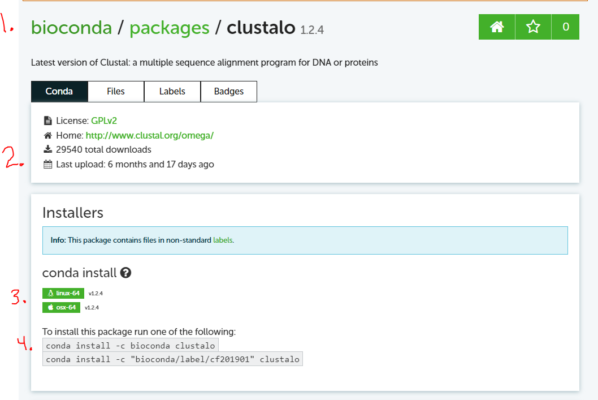

# Note on Submission<!-- omit from toc --> 

- This week, due to technical difficulties, I'll ask everyone to submit via Canvas rather than using Github/Gitpod.  You will still need to run certain steps in the gitpod environment.

---

- [Note on Submission](#note-on-submission)
  - [Activity 2.1: Sequencing Write-up](#activity-21-sequencing-write-up)
    - [Background](#background)
    - [Description](#description)
  - [Activity 2.2: Needleman Wunsch Alignment](#activity-22-needleman-wunsch-alignment)
    - [Background](#background-1)
    - [Description](#description-1)
  - [Activity 2.3: UPGMA Clustering](#activity-23-upgma-clustering)
    - [Background](#background-2)
    - [Description](#description-2)
  - [Activity 2.4: Using Software For Alignment](#activity-24-using-software-for-alignment)
    - [Background](#background-3)
    - [Description](#description-3)
    - [Running via the web server](#running-via-the-web-server)
    - [Running via software installed through Anaconda](#running-via-software-installed-through-anaconda)

## Activity 2.1: Sequencing Write-up

### Background

Dry-lab focused bioinformaticians may not regularly interact or operate sequencing instruments, an understanding (and ability to independently develop an understanding) of the instruments that generate the raw data they work with is a key skill. In this activity, you will research two sequencing instruments and write a short report comparing and contrasting the two instruments.  

### Description

You will research two sequencing instruments and write a short report that must include the following information:

**50% of Credit**

1. Name of the instruments
2. Method of sequencing (e.g. sequencing by synthesis? sanger sequencing? etc..)
3. Throughput (i.e. rate of raw data generation)
4. Cost (note: some costs are listed as "starting at $...", this is okay for this report)
5. Reference linking to the product page

Additionally, this report should also address the following critical thinking questions:

**50% of Credit**

1. Why is throughput reported in terms of data rather than number of reads?
2. Why do a range of instruments exist in the market rather then a single kind of instrument?


---

## Activity 2.2: Needleman Wunsch Alignment

### Background

After learning about the Needleman Wunsch Alignment Algorithm, you should be able to manually follow the algorithm to find the a pairwise sequence alignment.  In real practice, any algorithm in production usage will be written as software, but for understanding the underlying algorithm, a manual walk-through is often a useful exercise.

### Description


1. Generate a pair of sequences as follows:
   > `python scripts/generate_sequences.py <YOUR NAME>`
   
   *Note: these scripts should be run in the 'Terminal' of your gitpod vscode session.*

   - Include the printout from the program

   ``` bash
   # example script run
   python scripts/generate_sequences.py Jonathan Oribello

   # example output
   Random Seed String: Jonathan_Oribello
   Sequence 1: TGGA
   Sequence 2: AGA
   ```

1. Using the same scoring rules as the slides, compute the optimal alignment and alignment score.

---

## Activity 2.3: UPGMA Clustering

### Background

Similar to Needleman Wunsch, we will manually practice the algorithm to solidify understanding.

### Description

1. Generate a pair of matrix of similarities as follows:
   > `python scripts/generate_matrix.py <YOUR NAME>`
   
   *Note: these scripts should be run in the 'Terminal' of your gitpod vscode session.*

   - Include the printout from the program

   ``` bash
   # example script run
   python scripts/generate_maxtrix.py Jonathan Oribello

   # example output
   =================================
   Random Seed String: Jonathan_Oribello
   Distances
   ----------------
   A to B: 12
   A to C: 3
   A to D: 48
   B to C: 14
   B to D: 30
   C to D: 57
   =================================
   ```

1. Construct the full tree and submit the image to the Canvas dropbox for this activity.

---

## Activity 2.4: Using Software For Alignment

### Background

In practice, basically all actual algorithms are run via software.  Finding, setting up, and using such software is a skill a working bioinformatician will need to use on a regular basis (if not every day).

In this activity, you will perform Multiple Sequence Alignment using [Clustal Omega](http://www.clustal.org/omega/) to learn about best practies in using software created by others.

### Description

You will run Clustal Omega in two different ways:

1. Clustal Omega via the web server
2. Clustal Omega via software installed through Anaconda and run locally (in the gitpod)

---

### Running via the web server

**50% of credit**

The Clustal Omega software is hosted as a web server by the European Molecular Biology Laboratory's European Bioinformatics Institute (EMBL-EBI).  A web server most often involves a website with a graphical user interface (GUI) that allows users to do the following:

1. Submit input data
1. Customize parameters for the software
1. Run the software (on their servers, not yours)
1. Get the output and explore via a GUI

For this activity, you will peform the following:

**Note**: References to 'Steps' refer to the 'Steps' on the web page in this set of instructions

1. Navigate to the web server page at [https://www.ebi.ac.uk/Tools/msa/clustalo/](https://www.ebi.ac.uk/Tools/msa/clustalo/)
1. Copy the contents of the the file 'data/msa_input.fa' into the Step 1 box.
1. **Don't** change parameters for this activity in Step 2
1. Submit the job in Step 3
1. You will be taken to an interim waiting page, wait a few seconds it should finish quickly and take you to the results page
1. Once on the results page, answer the following questions (You will need to navigate the tabs on the results page):
   - What was the version of clustalo used by the web server?
   - When did you run this job?
   - What input parameters were used?
   - Based on the Guide Tree, what protein is least similar to the other three?
   - How can you download the alignment output from this job?

### Running via software installed through Anaconda

**50% credit**

Now that we have run Clustal Omega via the web server, we will run the software directly on our compute resources.  

First, we need to install the software onto the gitpod workspace.

Traditionally, software installation was a technically intensive task that required manually installing software piece by piece with varying installation tools and requirements.  

To make matters worse, all software is built upon other software, we call these *dependencies* and installing a relatively simple tool could often require installing a wide number of dependencies as well (in fact it could be so bad the term [Dependency Hell](https://en.wikipedia.org/wiki/Dependency_hell) was coined to describe how frusterating the process could be for complex cases ).

Thankfully, in recent years, a number of solutions to software installation have been developed. These solutions free up bioinformaticians to focus on using the software over setting it up.

One such solution is [Anaconda](https://www.anaconda.com), which allows users to simply install software and all required dependencies with a single command.

In this activity, we will install the software using Anaconda (which was preinstalled in your workspace)

1. Find Clustal Omega on Anaconda
   > Googling 'clustal omega anaconda' should yield this as a first link: https://anaconda.org/bioconda/clustalo
1. You should see a page like the following, below the image are some points to focus on:

   1. 'bioconda' is the Anaconda channel that offers the Clustal Omega (here named by alternative name 'clustalo')
      - Anaconda will actually allow anyone to create a channel and add software to that channel.  Anytime we are considering using software others have written, we should assess if the source is reliable.  In general practice, the `Anaconda`,`r`, and`conda-forge` and `bioconda` channels make up the majority of channels you will use and are curated by either the Anaconda company or a well trusted community group. For most well-used bioinformatics software, the `bioconda` channel includes up-to-date software.
   2. The link to the software home page and other useful software details are noted here. The software home page is often where the requested citation for the tool is located. Citing the Anaconda url is **not** sufficient in citing the tool.
   3. This section shows the operating systems the tool is compatible with and the latest versions for each operating system.  In this case, we see only Mac and Linux are supported for this tool (don't worry the gitpod workspace is a Linux system).
   4. These commands can be copied and pasted into the terminal to install the tool.
1. Copy and run the **first** command given by the webpage and run in your terminal.  A printout of what will be installed and a prompt to continue are presented.
1. Once installed, you now have Clustal Omega (named clustalo in the sytem) available for usage.  You can now run clustalo as follows:
   ``` bash
   clustalo -i data/msa_input.fa -o msa_output_with_anaconda.fa
   ```
1. This will produce a new file `msa_output_with_anaconda.fa`. Open it an compare to the results from the Clustal Omega web server.
1. Notice the version is **not** included in the output file, it is best practice to record the version as reported by the tool itself.  For clustalo (and many other tools), this can be printed out by running the following command:
   ``` bash
   clustalo --version
   ```

1. Answer the following questions about this approach:
   - What was the version of clustalo installed through Anaconda?
   - What dependency did Anaconda also install when asked to install clustalo?
   - Referring to the command used, what does the '-i' mean? What about the '-o'?
   - Search for another bioinformatics tools, (try searching for on of the topics we have covered). Is the tool available on Anaconda? If so provide the url and the operating systems the tool can be installed on (Note: 'noarch' means any operating system!).

1. Answer the following questions comparing both approaches
   - What are pros and cons of both approaches in terms of the following:
      - Output data and results: 
        - Are the alignment results the same? 
        - Which was easier to interpret? 
        - Which had additional output/value beyond the alignment output itself?
      - Throughput considerations: 
        - Which tool would you likely use if you needed to perform 2000 MSA's (note: not 2000 sequences in one MSA but 2000 MSA's!)
      - Reproducibility:
        - Which approach could be used to run an older version of Clustal Omega? (an example use case would be to reproduce results of an article from the past)


